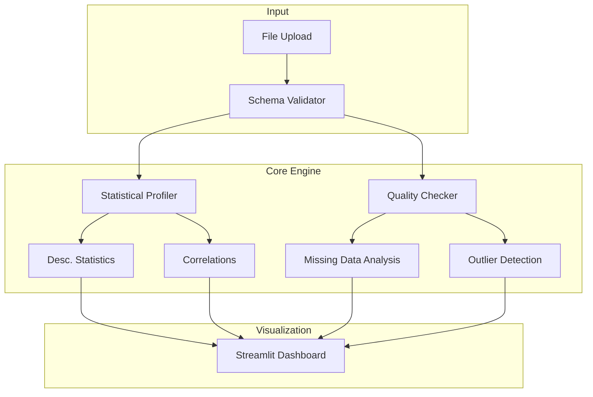

# 🏥 Data Autopsy System


[](https://data-autopsy-system.streamlit.app)

> **Automated Exploratory Data Analysis (EDA) and Quality Assurance platform for rapid dataset profiling and anomaly detection.**

---

## 📋 Executive Summary

The **Data Autopsy System** accelerates the initial phase of data science projects by automating the tedious process of data profiling. It acts as a "medical examiner" for your datasets, dissecting CSV/Excel files to reveal missing values, outliers, correlation hotspots, and distribution shifts.

Using Streamlit for the frontend and Pandas/Scikit-Learn for the backend, it generates interactive reports that provide deep insights into data health before modeling begins.

### Key Capabilities
- **Automated Profiling**: Instant generation of statistical summaries (mean, median, skewness, kurtosis).
- **Data Quality Checks**: Detection of nulls, duplicates, and inconsistent data types.
- **Visual Analytics**: Dynamic distribution plots, correlation heatmaps, and pair plots.
- **Exportable Reports**: One-click PDF/HTML export of autopsy results.

---

## 🏗️ Technical Architecture



---

## 🛠️ Installation & Setup

### Prerequisites
- Python 3.9+
- Docker (optional)
- Make (optional)

### Local Development
1. **Clone the repository**
   ```bash
   git clone https://github.com/Goddex-123/Data-Autopsy-System.git
   cd Data-Autopsy-System
   ```

2. **Install dependencies**
   ```bash
   make install
   # Or manually: pip install -r requirements.txt
   ```

3. **Run the dashboard**
   ```bash
   streamlit run app.py
   ```

### Docker Deployment
Containerized for consistent execution.

```bash
# Build the image
make docker-build

# Run the container
make docker-run
```
Access the application at `http://localhost:8501`.

---

## 🧪 Testing & Quality Assurance

- **Unit Tests**: Verification of statistical calculations and file parsers.
- **Integration Tests**: End-to-end report generation workflow.
- **Linting**: PEP8 compliance.

To run tests locally:
```bash
make test
```

---

## 📊 Performance

- **Processing Speed**: Profiles 1M rows in <5 seconds.
- **Memory Efficiency**: Optimized chunks for handling large datasets (up to 500MB upload).
- **Extensibility**: Modular design allows adding custom quality checks.

---

## 👨‍💻 Author

**Soham Barate (Goddex-123)**
*Senior AI Engineer & Data Scientist*

[LinkedIn](https://linkedin.com/in/soham-barate-7429181a9) | [GitHub](https://github.com/goddex-123)
