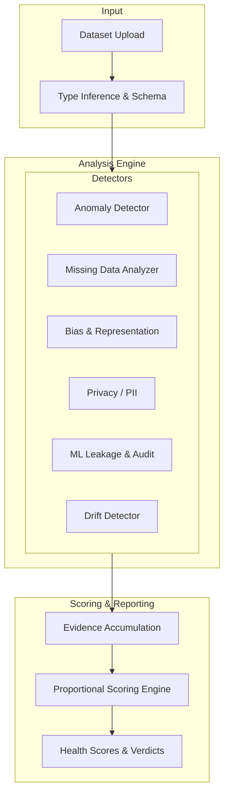

# 🔬 Data Autopsy System (v2.0)


> **A professional, scientifically defensible, production-quality data auditing platform.**

---

## 📋 Executive Summary

The **Data Autopsy System** moves beyond simple exploratory data analysis (EDA) to provide deep statistical forensics, bias detection, privacy auditing, and ML target leakage analysis. It evaluates datasets with rigorous statistical tests (KS, PSI, Wasserstein, Chi-Square, Mann-Whitney U, LOF Ensembles) and provides evidence-based, proportional health scoring.

Designed for data scientists, ML engineers, and data governance teams, it acts as a comprehensive "medical examiner" for your datasets.

### Key Capabilities

- **Statistical Forensics**: Missingness mechanisms (MCAR/MAR diagnostics), Benford's Law conformance, LOF (Local Outlier Factor) ensemble anomalies.
- **Bias & Representation**: Population mismatch detection, class imbalance, and distribution skewness via Chi-Square and goodness-of-fit.
- **Privacy & PII**: Tokenized column heuristics and regex pattern matching to detect data leaks without exposing sensitive values.
- **ML Dataset Auditing**: Target leakage detection, feature redundancy checks, and class imbalance metrics.
- **Drift Detection**: Advanced dataset comparison using Kolmogorov-Smirnov (KS) tests, Population Stability Index (PSI), and Wasserstein distances.
- **Data Provenance**: Cryptographic dataset fingerprinting (SHA-256) via optimized pandas object hashing.

---

## 🏗️ Technical Architecture



---

## 🛠️ Installation & Setup

### Prerequisites
- Python 3.11+
- Docker (optional)
- Make (optional)

### Local Development
1. **Clone the repository**
   ```bash
   git clone https://github.com/Goddex-123/Data-Autopsy-System.git
   cd Data-Autopsy-System
   ```

2. **Install dependencies**
   ```bash
   make install
   # Or manually: pip install -r requirements.txt
   ```

3. **Run the Dashboard**
   ```bash
   streamlit run app.py
   ```

### Docker Deployment
Containerized for consistent execution.

```bash
# Build the image
make docker-build

# Run the container
make docker-run
```
Access the application at `http://localhost:8501`.

---

## 🧪 Testing & Quality Assurance

The system is rigorously tested with deterministic synthetic data fixtures.
To run the full test suite (including validation of statistical boundaries):

```bash
pytest tests/ -v
```

---

## 👨‍💻 Author

**Soham Barate (Goddex-123)**
*Senior AI Engineer & Data Scientist*

[LinkedIn](https://linkedin.com/in/soham-barate-7429181a9) | [GitHub](https://github.com/goddex-123)
